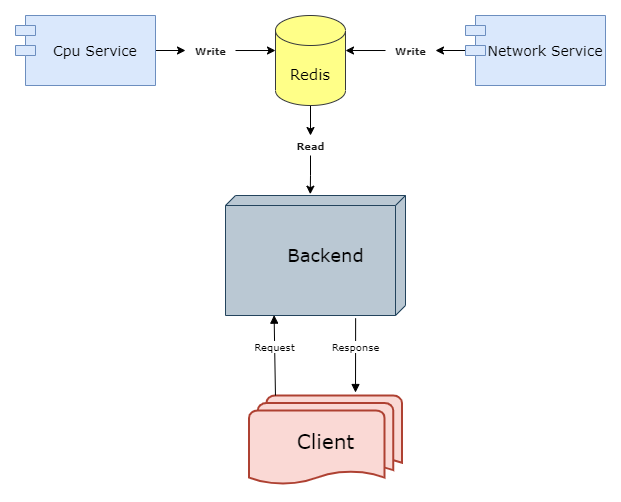
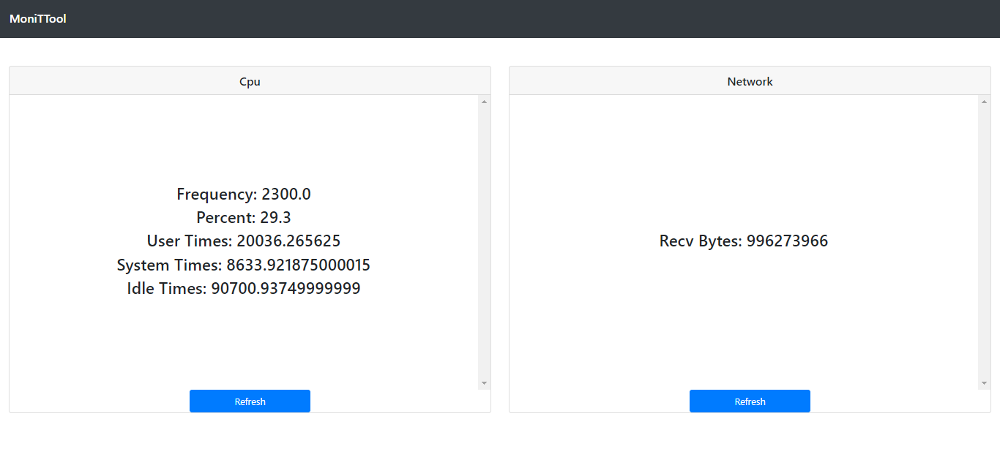

# Welcome to moniTTool

<p>
  <a href="https://twitter.com/ysndmk" target="_blank">
    
  </a>
</p>

> Monittool is a hardware monitoring tool. This tool consists of several microservices and illustrates hardware informations using by python, javaScript and redis.





<!-- ### ✨ [Demo](https://github.com/ydemek/moniTTool) -->

## Requirements

* Node.js
* Python3
* Redis

## Installation

>* Step 1:

Some npm modules needed

```bash
  $ cd web-server && npm install
  $ cd client && npm install
```

>* (optional) Step 2:

It's recommended to create a virtual environment for Python.

```bash
  $ python3 -m venv <VENV_NAME>
  $ source <VENV_NAME>/bin/activate
```

>* Step 3:

Some python modules also needed

```bash
  $ python3 -m pip install -r requirements.txt
```

>* Step 4:

All set up. We just need to run services.

```bash
  $ node web-server/app.js
  $ node client/app.js
  $ redis-server
  $ python3 cpu-service/cpu.py
  $ python3 network-service/network.py
```

## Author

:bust_in_silhouette: **Yasin Demek**

* [Website](https://ydemek.github.io)
* Twitter: [@ysndmk](https://twitter.com/ysndmk)
* Github: [@ydemek](https://github.com/ydemek)
* LinkedIn: [@yasin-demek](https://linkedin.com/in/yasin-demek)


:bust_in_silhouette: [@lymphatic](https://github.com/lymphatic)
